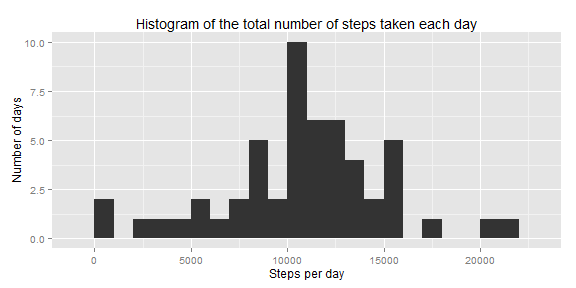
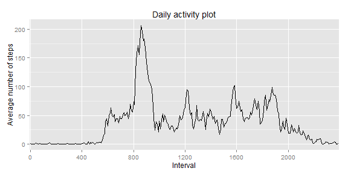
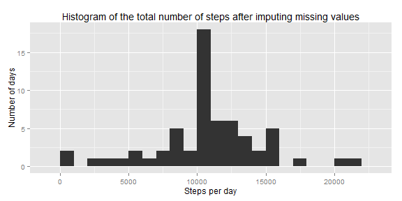
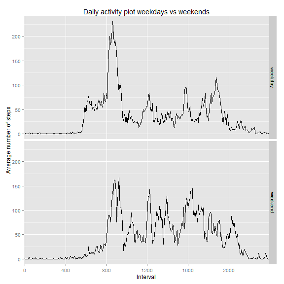

## Loading and preprocessing the data

```r
activity_data <- read.csv(
    unz('activity.zip', 'activity.csv'),
    colClasses=c('numeric', 'Date', 'integer'))

# Translate hour-minute integer to an ordinal, i.e.
#    0 translated to   1
#    5 translated to   2
#   55 translated to  11
#  100 translated to  12 (since it is 1am and 12th interval)
# 2355 translated to 288
# Much better to use these ordinals for x-axis on plots to avoid misleading jumps on hour ends, e.g., 1455->1500, 1555-> 1600, etc.
activity_data$intervalOrdinal <- 1 + (
              (activity_data$interval %/% 100) * 12
            + (activity_data$interval %% 100) %/% 5)

# data without NA values
activity_data_narm <- activity_data[!is.na(activity_data$steps),]

# vector of integer representations of all time intervals, i.e. 0, 5, 10, ..., 2350, 2355
intervals <- 100*((0:287) %/% 12) + 5*((0:287) %% 12)

# ticks for plots to show ticks every 4 hours
intervals_ticks_ordinals <- seq(1,288,48)

# labels for the ticks
intervals_ticks_labels <- intervals[intervals_ticks_ordinals]
```


## What is mean total number of steps taken per day?

```r
library(ggplot2)
steps_per_day <- with(activity_data_narm, tapply(steps, date, sum))
qplot(
    steps_per_day,
    binwidth=1000,
    xlab='Steps per day',
    ylab='Number of days',
    main="Histogram of the total number of steps taken each day")
```

 


```r
mean_steps <- mean(steps_per_day)
median_steps <- median(steps_per_day)
c(mean_steps, median_steps)
```

```
## [1] 10766.19 10765.00
```

Mean of the total number of steps taken each day: **10766.19**

Median of the total number of steps taken each day: **10765**

## What is the average daily activity pattern?

```r
steps_per_interval <- with(activity_data_narm, tapply(steps, intervalOrdinal, mean))
intervals_df <- data.frame(ordinals=1:288, steps_per_interval=steps_per_interval)
ggplot(data=intervals_df, aes(ordinals, steps_per_interval)) +
    geom_line() + 
    xlab('Interval') + 
    ylab('Average number of steps') + 
    ggtitle('Daily activity plot') + 
    scale_x_discrete(breaks=intervals_ticks_ordinals, labels=intervals_ticks_labels)
```

 


```r
max_average_steps_interval <- intervals[steps_per_interval==max(steps_per_interval)][1]
max_average_steps_interval
```

```
## [1] 835
```

Out of all 5-minute intervals on average the maximum number of steps is contained in the interval **835**.

## Imputing missing values

```r
number_of_missing_values <- sum(is.na(activity_data$steps))
number_of_missing_values
```

```
## [1] 2304
```
Total number of missing values in the dataset is **2304**.

We will use rounded mean value of steps for the corresponding interval as a substitute for the missing values.


```r
activity_data_filled <- transform(activity_data, steps=ifelse(is.na(steps), round(steps_per_interval[intervalOrdinal]), steps))
steps_per_day_filled <- with(activity_data_filled, tapply(steps, date, sum))
qplot(
    steps_per_day_filled,
    binwidth=1000,
    xlab='Steps per day',
    ylab='Number of days',
    main="Histogram of the total number of steps after imputing missing values")
```

 


```r
mean_steps_filled <- mean(steps_per_day_filled)
median_steps_filled <- median(steps_per_day_filled)
c(mean_steps_filled, median_steps_filled)
```

```
## [1] 10765.64 10762.00
```

Mean of the total number of steps taken per day after imputing missing values: **10765.64**

Median of the total number of steps taken per day after imputing missing values: **10762**

As we can see the change in mean and median number of steps taken per day is not very big:

* After imputing missing values mean number of steps per day is changed by **-0.549335**
* After imputing missing values median number of steps per day is changed by **-3**


## Are there differences in activity patterns between weekdays and weekends?

```r
date_weekdays <- weekdays(activity_data_filled$date, abbreviate = TRUE)
activity_data_filled$daytype <- factor(ifelse(date_weekdays=='Sun' | date_weekdays=='Sat', 2, 1) , labels=c('weekday', 'weekend'))

steps_per_interval_wday <- with(activity_data_filled,
                           tapply(steps, list(intervalOrdinal, daytype), mean))

intervals_df_weekday <- data.frame(ordinals=1:288, steps_per_interval=steps_per_interval_wday[,'weekday'], daytype='weekday')
intervals_df_weekend <- data.frame(ordinals=1:288, steps_per_interval=steps_per_interval_wday[,'weekend'], daytype='weekend')
intervals_df_full <- rbind(intervals_df_weekday, intervals_df_weekend)

ggplot(data=intervals_df_full, aes(ordinals, steps_per_interval)) +
    geom_line() +
    xlab('Interval') +
    ylab('Average number of steps') +
    ggtitle('Daily activity plot weekdays vs weekends') +
    scale_x_discrete(breaks=intervals_ticks_ordinals, labels=intervals_ticks_labels) +
    facet_grid(daytype ~ .)
```

 
